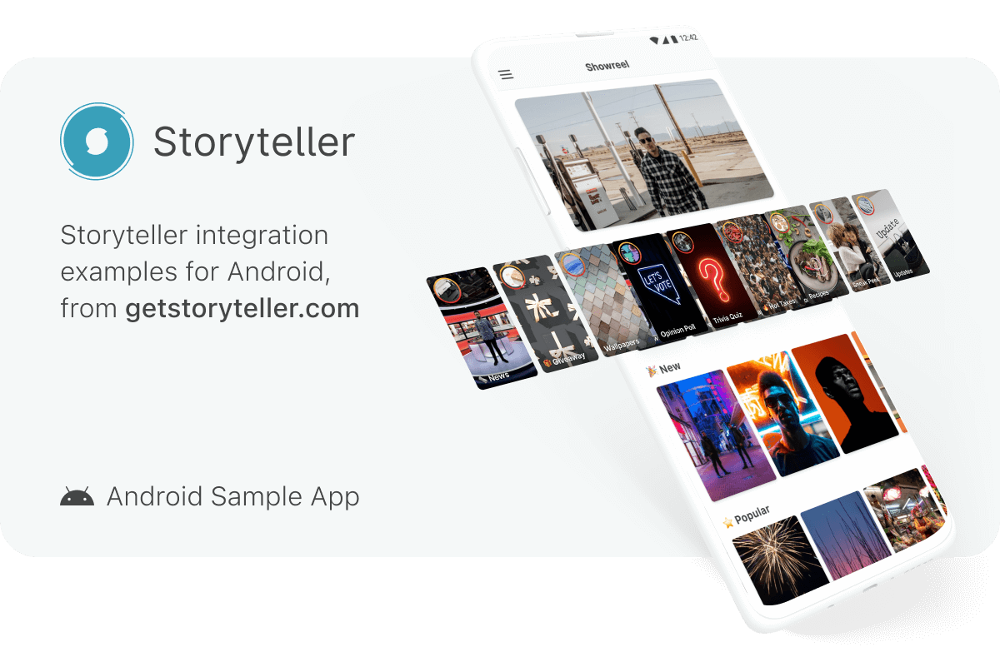

# Storyteller Android Sample App

  &nbsp;&nbsp;&nbsp;
  

Use this repo as a reference for integrating Storyteller in your Android App.

[Storyteller is also available for iOS](https://github.com/stormideas/storyteller-sample-android).

For help with Storyteller, please check our [Documentation and User Guide](https://docs.getstoryteller.com/documents/) or contact [support@getstoryteller.com](mailto:support@getstoryteller.com?Subject=Android%20Sample%20App).

## Building the Sample App

To build the sample app:
1. Update `gradle.properties` with your SDK License Key by replacing `[LICENSEKEY]` with the correct value (please refer to our guide on [Getting Started](https://docs.getstoryteller.com/documents/android-sdk/GettingStarted#how-to-add-the-sdk-to-your-project) for more details)
2. Run a Gradle Sync from within Android Studio
3. Supply your app's API Key in `AndroidManifest.xml` by replacing `[APIKEY]` with the correct value (please refer to our guide on [Getting Started](https://docs.getstoryteller.com/documents/android-sdk/GettingStarted#-1) for more details). Alternatively, remove the `StorytellerKey` manifest entry, uncomment and use the `Storyteller.initialize("[APIKEY]")` method in `MainActivity.kt` with an API Key.
